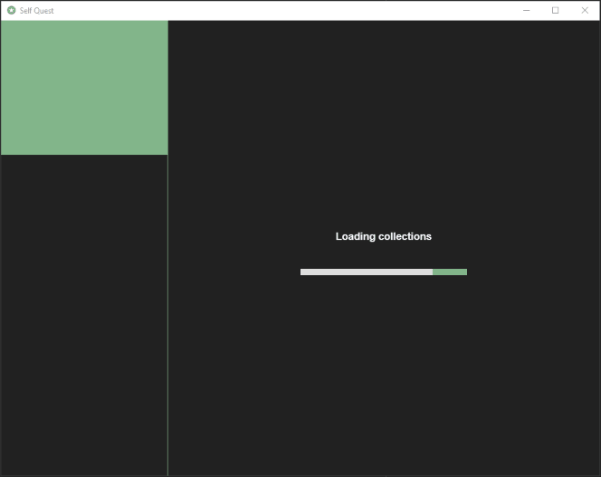
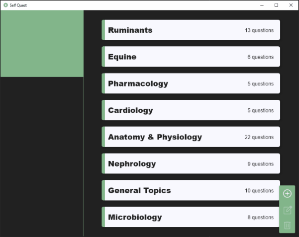

# :rocket: Self Quest :star::books:

Enhance your study strategy by creating your own questions using a single window desktop application built
with **JetBrains** [Compose for Desktop](https://www.jetbrains.com/lp/compose-desktop/) and [Ktor](https://ktor.io/).

  

## :memo: Desktop App details

A minimalist desktop application for generating quiz collections, using dual-mode interactive flash cards.

Every quiz question comes with an optional review slot that accepts detailed text (currently only with basic formatting), 
as well as links to external resources.

Switching to quiz mode currently only blocks access to the review slots and forces progression forward by requiring a 
chosen answer for each question.

  

## :briefcase: Desktop features

- UI events trigger Ktor HTTP client [`SQClient`](common/src/commonMain/kotlin/dev/bogwalk/client/SQClient.kt) in common 
module to make requests to server
- `Tab` layout allows easy switching between question and review slots or navigating an entire collection in either slot
- Pop-up dialogs triggered by either requesting data deletion or attempting to leave a form without saving
- Custom input forms with input validation
- Robust UI (unit and integration) test suites

## :memo: Server details

A self-hosted Ktor server application with persistence via an [H2 embedded database](https://www.h2database.com/html/features.html#connection_modes). 
Collections are saved in `build/demodb.mv.db`, based on specifications set in 
[`application.conf`](server/src/main/resources/application.conf).

## :briefcase: Server features

- [Exposed](https://github.com/JetBrains/Exposed) framework's typesafe DSL
- JDBC connection pooling using [HikariCP](https://github.com/brettwooldridge/HikariCP) framework
- Type-safe routing using the `Resources` plugin in[`Resources.kt`](common/src/commonMain/kotlin/dev/bogwalk/routes/Resources.kt)
- JSON deserialization into data objects using the `ContentNegotiation` plugin
- Both server DAO unit tests and routing tests using a custom `testApplication`

## :computer: Run desktop application

- Clone the repository

- Open the project in IntelliJ IDEA and run `Server.kt` from the server module

- Once the server has started, run `Main.kt` from the desktop module

Note that the server will automatically shut down as a part of the application exit process.

## :microscope: Run tests

Clone the repository then pick an option:

- Open the project in IntelliJ IDEA then choose specific tests using gutter icons in either the desktop or server module

- Open the Gradle toolbar and select `server/Tasks/verification/test` to run server-side tests or select 
`desktop/Tasks/verification/test` to run client-side tests 

- `./gradlew :server:test` or `./gradlew :desktop:test` from an open terminal in the root of the project